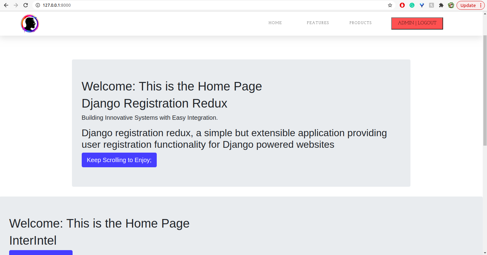

# <p align="center"> :key: DJANGO LOGIN <p>


# DESCRIPTION

A Simple Django Application Providing User Registration Functionality using Redux Registration Process for Django Websites.

# REDUX DEFINITION

Redux is a predictable state container designed to help you build apps that behave consistently across client, server, and native environments and are easy to test.

Redux implements many performance optimizations internally so that your own connected component only rerenders when it actually needs to.

# DISPLAY

## Admin Page

<p align="center">

<p>

## Login Page

<p align="center">

<p>

## Reset Password Page

<p align="center">

<p>

## Home Page

<p align="center">

<p>


# SET UP

1. Install django-registration-redux

```
pip install django-registration-redux
```

2. Add registration in to your INSTALLED_APPS

#### `settings.py`

```
INSTALLED_APPS = [
    ....
    'registration',
    ....
    ]
```

#### `settings.py`

```
ACCOUNT_ACTIVATION_DAYS = 7 # One-week activation window
REGISTRATION_AUTO_LOGIN = True # Automatically log the user in.
SITE_ID = 1
LOGIN_REDIRECT_URL = '/'
```

3. Migrate for registration tables to be created in the database

```
python manage.py migrate
```

4. Add a url to include urls from registration app you just installed

#### `urls.py`

```
    # REGISTRATIION PAGE Url Pattern!

    path('accounts/', include('registration.backends.default.urls')),
```

Users would then be able to register by visiting the URL ```/accounts/register/``` login (once activated) at ```/accounts/login/```.

5. In your template folder, make a template page and name it base.html

#### `base.html`

```





<html>
<head>
    <meta charset="utf-8">
    <meta name="viewport" content="width=device-width, initial-scale=1.0">
    <meta http-equiv="X-UA-Compatible" content="ie=edge">
    <title> Django Login</title>

    
    
    <link rel="stylesheet" href="">
    <link rel="stylesheet" href="">
    
</head>
<body style="margin-top: 300px; margin-left: 40%;" >

 
<form method="post" action="">
    
    {{ form.as_p }}
    <input type="submit" value="" />
    <input type="hidden" name="next" value="{{ next }}" />
</form>

<p> <a href=""></a>.</p>
<p> <a href=""></a>.</p>





<script src=""></script> 
 

</body>
</html>
```

6. Import login required decorator and place them above all views that needs login before accessing.


```
from django.contrib.auth.decorators import login_required

#Home page view function
@login_required
def index(request):
	title = 'Welcome: This is the Home Page'
	context = {
	    "title": title,
	}
	return render(request, "Success/index.html",context)
```

This restricts site to unauthenticated users and redirects them to login page when they try access the restricted url

7. Login to the app through this url: ```/accounts/login```

    Logout URL is: ```/accounts/logout```

#  PREREQUISITES

- You need to have nano text editor installed. you can find out whether you have it installed by typing nano --version in your terminal. For most linux distributions, it is installed by default. However, if you don't have it installed, you can quicky do that by typing sudo apt-get install nano in your terminal.

- You need to have (python3.8) installed in your machine

- Python3.8. Installation ```$ sudo apt-get install python3.8```

- Django3.17. Installation ```$ pip install django==3.17```

- Psycopg2. Installation ```$ pip install psycopg2```

- Bootstrap4. Installation ```$ pip install django-bootstrap4```


# SETUP/INSTALLATION REQUIREMENTS.

**Follow The Below nstructions For Set Up.**

- Internet connection

- webpage URL:

- To get to this webpage fist you need to get to my github repository

- The link to my github Repository is: https://github.com/zecollokaris

- from there you can access the project

- git clone project.

- install dependancies in requirements.txt file ```$ pip install -r requirements.txt```

- cd into project

- create a virtual environment ```$ python3.6 -m venv virtual```

- Activate Virtual Environmrnt. ```$ source virtual/bin/activate```

- Run The Project-: ```$ python manage.py runserver```


# TECHNOLOGIES USED
- HTML5 

- CSS

- Bootstarap

- Python3.8

- Django 3.1.7

- Psycopg2 

- PostgreSQL
